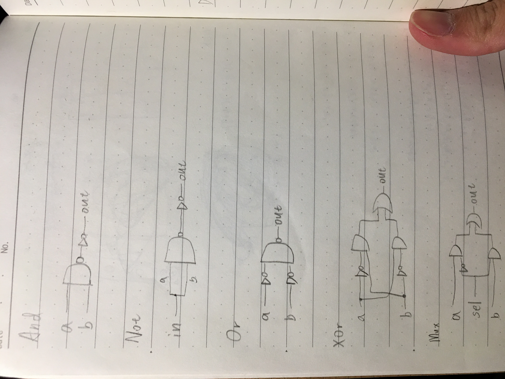
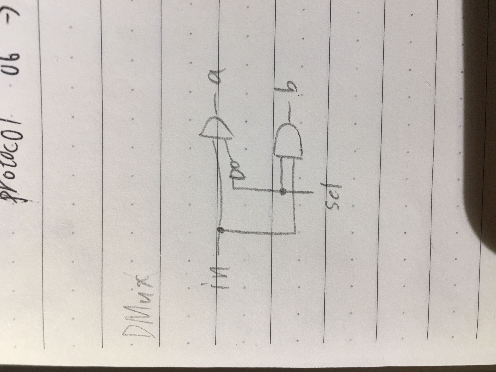

第一週  
-----------------------------
And  
-------------------------------
```
 CHIP And { 
    IN a, b;
    OUT out;

    PARTS:
    // Put your code here:
    Nand(a=a, b=b, out=AnandB);
    Not(in=AnandB, out=out);
}
```  
Not  
-----------
```CHIP Not {
    IN in;
    OUT out;

    PARTS:
    // Put your code here:
    Nand(a=in, b=in, out=out);
}
```
Or
---
```
CHIP Or {
    IN a, b;
    OUT out;

    PARTS:
    // Put your code here:
    Not(in=a, out=na);
    Not(in=b, out=nb);
    Nand(a=na, b=nb, out=out);
}
```
Xor
---
```
CHIP Xor {
    IN a, b;
    OUT out;

    PARTS:
    // Put your code here:
    Not(in=a, out=na);
    Not(in=b, out=nb);
    And(a=na, b=b, out=nab);
    And(a=a, b=nb, out=anb);
    Or(a=nab, b=anb, out=out);
}
```
Mux
---
```
CHIP Mux {
    IN a, b, sel;
    OUT out;

    PARTS:
    // Put your code here:
    Not(in=sel, out=nsel);
    And(a=a, b=nsel, out=ansel);
    And(a=b, b=sel, out=bsel);
    Or(a=ansel, b=bsel, out=out);
}
```
DMux
---
```
CHIP DMux {
    IN in, sel;
    OUT a, b;

    PARTS:
    // Put your code here:
    Not(in=sel, out=nsel);
    And(a=nsel, b=in, out=a);
    And(a=sel, b=in, out=b);
}
```



